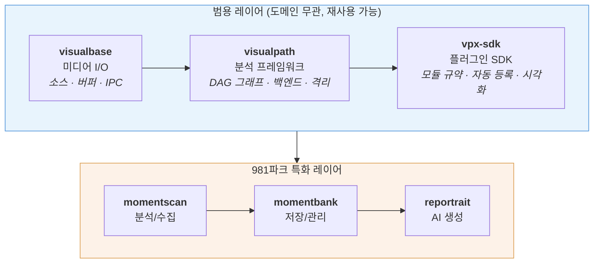

# Portrait981 데모 시연 + 개발 리뷰 가이드

> 대상: 팀 내부 | 소요: ~35분 | 목표: 전체 파이프라인 흐름 이해 + 주요 알고리즘 리뷰 + 기반 기술 어필

---

## 1. 프로젝트 소개 (2분)

### 한 줄 요약

> "981파크 탑승 영상에서 **하이라이트 순간을 자동 감지**하고, **최적의 참조 프레임을 수집**한 뒤, **AI로 초상화를 생성**한다."

### 전체 아키텍처



**핵심 설계 원칙**: 범용 레이어는 981파크를 모른다. 어떤 영상 분석 서비스에도 재사용 가능.

---

## 2. 범용 레이어 ① — visualbase (3분)

> 핵심 메시지: "어떤 영상 소스든 동일한 인터페이스로 다룬다"

### 통합 소스 추상화

```python
from visualbase import VisualBase, FileSource, CameraSource, RTSPSource

vb = VisualBase()
vb.connect(FileSource("video.mp4"))       # 파일
# vb.connect(CameraSource(0))             # USB 카메라
# vb.connect(RTSPSource("rtsp://..."))    # IP 카메라

for frame in vb.get_stream(fps=30):
    process(frame.data)   # 항상 동일한 Frame 객체
```

3가지 소스, 하나의 API. 소스 종류에 따라 내부 버퍼가 자동 선택됨:
- **파일** → FileBuffer (seek 기반)
- **스트리밍** → RingBuffer (tmpfs 순환 버퍼, 24시간 무중단 운영)

### Trigger 기반 클립 추출

```python
from visualbase import Trigger

# 특정 순간 ± 전후 구간 추출
trigger = Trigger.point(event_time_ns=10_000_000_000, pre_sec=3.0, post_sec=2.0)
result = vb.trigger(trigger)   # → 7초~12초 구간 MP4
```

FFmpeg stream copy로 빠른 추출, 파일/스트리밍 소스 모두 동작.

### IPC 인프라

모든 프로세스 간 통신의 **단일 인프라 레이어**:

| Transport | 프레임 전송 | 메시지 | RPC | 용도 |
|-----------|-----------|--------|-----|------|
| **FIFO** | O | - | - | 로컬 고속 스트리밍 |
| **UDS** | - | O | - | 로컬 메시지 (저오버헤드) |
| **ZMQ** | O | O | O | 분산/네트워크 배포 |

런타임에 전송 수단 교체 가능 (TransportFactory). visualpath-isolation이 이 위에 분석 프로토콜을 구현.

---

## 3. 범용 레이어 ② — visualpath (3분)

> 핵심 메시지: "파이프라인을 선언하면, 실행은 백엔드가 알아서 한다"

### 선언적 파이프라인 (AST/Interpreter 패턴)

```python
# 파이프라인 선언 (무엇을 할지)
graph = (FlowGraphBuilder()
    .source("frames")
    .path("analysis", modules=[face_detect, smile_trigger])
    .on_trigger(handle_trigger)
    .build())

# 실행은 백엔드에 위임 (어떻게 할지)
result = SimpleBackend().execute(frames, graph)
```

**FlowGraph** = 파이프라인의 AST (추상 구문 트리)
- 17종 NodeSpec으로 소스, 분석, 필터, 분기, 합류를 선언
- 모든 spec은 immutable dataclass

**Backend** = AST를 해석하는 인터프리터
- 동일한 그래프가 다른 백엔드에서 실행 가능

| 백엔드 | 특징 | 용도 |
|--------|------|------|
| **SimpleBackend** | 순차/병렬, 배치 처리 | 개발, 로컬 실행 |
| **WorkerBackend** | 모듈별 프로세스/venv 격리 | ML 의존성 충돌 해결 |
| **PathwayBackend** | Rust 스트리밍, 워터마크, 백프레셔 | 실시간 처리 |

### 4단계 격리 수준

코드 변경 없이 격리 수준만 바꿀 수 있다:

```
INLINE (0)  → 같은 프로세스, 같은 스레드 (가장 빠름)
THREAD (1)  → 같은 프로세스, 다른 스레드
PROCESS (2) → 같은 venv, 다른 프로세스
VENV (3)    → 다른 venv, 다른 프로세스 (onnxruntime GPU/CPU 공존)
```

워커 격리는 투명하게 동작 — 모듈 코드는 격리 수준을 모른다.

### 3-Level API

```python
# Level 0: 코어 (완전 제어)
graph = FlowGraph()
graph.add_node(source); graph.add_node(path); graph.add_edge(...)

# Level 1: 빌더 (간결한 선언)
graph = FlowGraphBuilder().source("s").path("p", modules=[...]).build()

# Level 2: 앱 컨벤션 (최소 코드)
class MyApp(vp.App):
    modules = ["face.detect", "face.expression"]
    def after_run(self, result): ...
result = MyApp().run("video.mp4")
```

---

## 4. 범용 레이어 ③ — vpx-sdk + 플러그인 시스템 (3분)

> 핵심 메시지: "분석 모듈을 만들고, 등록하고, 테스트하는 전체 워크플로우가 자동화되어 있다"

### 통합 모듈 인터페이스

```python
class FaceDetector(Module):
    depends = []                          # 의존성 선언

    @property
    def name(self) -> str:
        return "face.detect"              # 도메인.액션 네이밍

    def process(self, frame, deps=None) -> Observation:
        faces = self._detect(frame.data)
        return Observation(               # 통합 출력
            source=self.name,
            signals={"face_count": len(faces)},
            data=FaceDetectOutput(faces=faces),
        )
```

- 모든 모듈이 `Module` → `Observation` 단일 인터페이스
- `depends` 선언만으로 실행 순서 자동 결정 (토폴로지 정렬)
- `deps` dict로 이전 모듈 결과 접근

### 자동 스캐폴딩 — `vpx new` 시연

```bash
# 새 분석 모듈 자동 생성
vpx new face.landmark --depends face.detect
```

**한 줄로 생성되는 것들**:

```
libs/vpx/plugins/face-landmark/
├── pyproject.toml          # 패키지 메타데이터 + entry point 등록
├── src/vpx/face_landmark/
│   ├── __init__.py         # re-export
│   ├── analyzer.py         # FaceLandmarkAnalyzer 스텁
│   ├── output.py           # FaceLandmarkOutput 데이터클래스
│   └── backends/base.py    # 백엔드 Protocol
└── tests/
    └── test_face_landmark.py   # PluginTestHarness 포함
```

- root `pyproject.toml` workspace members에 **자동 등록**
- `vpx list`에 **자동 발견** (entry_points 기반, 수동 등록 불필요)
- `vpx run face.landmark --input video.mp4`로 **즉시 실행**

### 현재 플러그인 생태계

```
8개 vpx 플러그인 (외부 ML 모델):
  face.detect (InsightFace SCRFD)     face.expression (HSEmotion)
  face.parse  (BiSeNet)               face.au (LibreFace)
  head.pose   (6DRepNet)              portrait.score (CLIP)
  body.pose   (YOLO-Pose)             hand.gesture (MediaPipe)

6개 앱 내부 분석기 (ML 불필요):
  face.classify  face.quality  face.baseline
  face.gate      frame.quality  frame.scoring
```

### 시각화 마크 시스템

분석 모듈은 "무엇을 그릴지"만 선언, 렌더링은 별도:

```python
def annotate(self, obs) -> List[Mark]:
    return [
        BBoxMark(x1, y1, x2, y2, label="face:main"),   # 바운딩 박스
        AxisMark(cx, cy, yaw, pitch, roll),               # 3D 머리 축
        BarMark(x, y, value=0.8, label="smile"),          # 강도 바
    ]
```

---

## 5. 알고리즘 리뷰 ① — 하이라이트 탐지 (5분)

> 핵심 메시지: "7단계 파이프라인이 영상에서 '최고의 순간'을 자동으로 찾아낸다"

### BatchHighlightEngine 파이프라인

```
프레임별 14개 분석 결과 (on_frame 축적)
    ↓
[1] 특징 배열 구성    — FrameRecord → numpy 배열
[2] 시간 변화량 계산  — EMA 기준선 대비 delta
[3] 영상별 정규화     — MAD z-score → [0,1] 리스케일
[4] 품질 게이트       — 얼굴 검출 신뢰도, 블러, 노출 등 이진 필터
[5] 스코어링          — Quality + Impact + Passenger Bonus
[6] 시간 스무딩       — EMA(α=0.25)로 노이즈 제거
[7] 피크 탐지 + 윈도  — scipy.find_peaks → ±1초 윈도 + 베스트 프레임
    ↓
HighlightResult (윈도별 타임스탬프, 점수, 선택된 프레임)
```

### 핵심 알고리즘 설명

**[2] 시간 변화량 (Delta) — "변화를 포착한다"**

```
delta(t) = |feature(t) - EMA_baseline(t)|     (α = 0.1)
```

- 절대값이 아닌 **변화량**을 측정 → 배경 애니메이션, 고정 장면에 강건
- 대상 신호: `smile_intensity`, `head_yaw`, `face_area_ratio` 등 6개

**[3] MAD z-score 정규화 — "이상치에 강건한 정규화"**

```
z = (x - median) / MAD                     MAD = median(|x - median|)
rescaled = min(z⁺ / percentile₉₈(z⁺), 1.0)
```

- **왜 MAD?** 표준편차 대비 이상치(장면 전환 등)에 강건
- **왜 리스케일?** z-score 범위가 신호마다 다름 (smile z_max≈16, yaw z_max≈5) → 가중치가 실제로 의미를 가지려면 [0,1] 통일 필수

**[4] 품질 게이트 — "사용 불가 프레임 제거"**

| 조건 | 임계값 | 의미 |
|------|--------|------|
| face_confidence | ≥ 0.7 | 얼굴 검출 신뢰도 |
| face_blur (Laplacian) | ≥ 5.0 | 얼굴 영역 선명도 |
| brightness | 40~220 | 노출 범위 |
| parsing_coverage | ≥ 0.50 | BiSeNet 세그멘테이션 커버리지 |
| contrast (std/mean) | ≥ 0.05 | 로컬 대비 |

- **Main**: 하나라도 실패 → gate_passed = False (hard filter)
- **Passenger**: 항상 통과, 대신 suitability score(0~1) = conf × parse 산출

**[5] 스코어링 공식 — "품질과 감성의 균형"**

```
Final = 0.35 × Quality + 0.65 × Impact + 0.30 × Passenger Bonus
```

| 구성 요소 | 가중치 | 세부 |
|----------|--------|------|
| **Quality** | 0.35 | blur(0.30) + face_size(0.20) + identity(0.30) |
| **Impact** | 0.65 | smile(0.25) + head_yaw_delta(0.15) + portrait_best(0.25) |
| **Passenger** | 0.30 | 동승자 suitability × 0.30 (additive) |

- **Quality**: 기술적 촬영 품질 (선명도, 크기, 인물 인식)
- **Impact**: 감정적/예술적 의미 (미소, 동작, CLIP 미학)
- Impact에 smile은 **절대값** (영상 내 최고 미소), yaw는 **변화량** (고개 돌림 감지)

**카탈로그 모드** — 카탈로그가 있으면 Impact를 카테고리별 유사도로 대체:

```
impact = Σ(category_similarity × weight) / max_achievable
```

**[7] 피크 탐지 — "이중 prominence로 다양한 영상에 대응"**

```python
prominence = min(
    percentile₉₀(scores),         # 절대 기준 (고 베이스라인 영상 대응)
    score_range × 0.30             # 상대 기준 (고 분산 영상 대응)
)
peaks = find_peaks(smooth_scores, prominence=prominence, distance=2.5sec)
```

두 기준의 **min**을 사용하여 모든 유형의 영상에서 안정적으로 피크 탐지.

---

## 6. 알고리즘 리뷰 ② — 참조 프레임 수집 (3분)

> 핵심 메시지: "Pose × Category 그리드로 다양성을 보장한다"

### Collection Engine 파이프라인

```
CollectionRecord[] (프레임별 ArcFace 임베딩 + 신호)
    ↓
[1] 품질 게이트         — confidence, blur 필터
[2] Medoid Prototype    — 정면 프레임 중 가장 중심적인 임베딩
[3] 안정성 필터         — cos_sim(frame, prototype) ≥ 0.35
[4] Pose 분류           — yaw/pitch → nearest PoseTarget
[5] Category 분류       — 카탈로그 유사도 또는 AU 규칙 매칭
[6] Cell Score 계산     — pose_fit × catalog_sim × (1 + 0.3×quality)
[7] 그리드 선택         — 셀별 top-k + 시간 중복 제거 (≥1.5초 간격)
    ↓
PersonCollection (pose × category 그리드)
```

### 왜 그리드인가?

| 접근 | 방식 | 문제 |
|------|------|------|
| **Top-K 글로벌** | 점수 상위 K장 선택 | 같은 각도/표정만 집중 → 다양성 부족 |
| **Pose × Category 그리드** | 각 셀에서 top-2 선택 | 강제 다양성 → ComfyUI 생성 품질 향상 |

### 그리드 예시

```
           neutral    smile     surprised
frontal   [✓ ✓]      [✓]       [  ]
3/4 view  [✓]        [✓ ✓]     [  ]
side      [✓]        [  ]      [  ]
look-up   [  ]       [✓]       [  ]
```

→ 30초 영상에서 ~10장의 다양한 참조 프레임 자동 수집

### Cell Score — "적합도 × 유사도 × 품질"

```
cell_score = pose_fit × catalog_sim × (1 + 0.3 × quality)
```

- **pose_fit**: 목표 포즈까지의 거리 → [0,1] (가까울수록 높음)
- **catalog_sim**: 목표 카테고리와의 CLIP 유사도 → [0,1]
- **quality**: (blur + size + frontalness + confidence) / 4
- 곱셈 구조: 어느 하나라도 0이면 전체 0 → 세 조건 모두 충족 필수

---

## 7. 알고리즘 리뷰 ③ — 카탈로그 스코어링 (3분)

> 핵심 메시지: "CLIP + AU + 감정을 결합한 21차원 신호 프로필로 미학적 카테고리를 정의한다"

### Signal Profile (21차원 벡터)

```
10 AU   : au1_inner_brow ~ au26_jaw_drop (LibreFace, [0,5])
 4 감정  : em_happy, em_neutral, em_surprise, em_angry (HSEmotion, [0,1])
 3 포즈  : head_yaw_dev, head_pitch, head_roll (degrees, normalized)
 4 CLIP축: warm_smile, cool_gaze, playful_face, wild_energy ([0,1])
```

### 카테고리 프로필 구축 — Fisher Ratio 가중치

```
1. 카테고리별 참조 이미지 분석 → 평균 신호 벡터
2. 카테고리 쌍별 Fisher 비율 계산:
   fisher_ij(d) = (mean_i(d) - mean_j(d))² / (var_i(d) + var_j(d))
3. √ 변환 → 정규화 → importance_weights (합=1)
```

- **왜 Fisher 비율?** 카테고리 간 **판별력**이 높은 차원에 높은 가중치
- **왜 √ 변환?** 극단적 차원이 나머지를 압도하는 것 방지

### 런타임 매칭 — 가중 유클리드 거리

```python
distance = √(Σ weight_d × (frame_d - profile_d)²)
similarity = 1 / (1 + distance)    # → (0, 1]
```

### CLIP 축 스코어링 — 양극 축 설계

```python
# 각 축은 positive/negative 프롬프트 쌍
cos_pos = cos_sim(image_embed, positive_embed)
cos_neg = cos_sim(image_embed, negative_embed)
score = sigmoid(scale × (cos_pos - cos_neg))    # → [0, 1]
```

| 축 | Positive | Negative |
|----|----------|----------|
| warm_smile | "warm gentle Duchenne smile" | "hard laughing, blank neutral" |
| cool_gaze | "cool confident smirk" | "warm friendly smile" |
| playful_face | "playful mischievous" | "serious solemn" |
| wild_energy | "wild untamed energy" | "calm composed" |

- **왜 양극?** Positive만 쓰면 대부분 이미지가 약간의 유사도를 가짐 → 판별력 부족
- Positive - Negative **상대 위치**를 측정하여 판별력 극대화

---

## 8. 알고리즘 리뷰 ④ — Memory Bank (2분)

> 핵심 메시지: "영상을 처리할수록 인물 메모리가 누적되어 참조 품질이 향상된다"

### MemoryBank 업데이트 알고리즘

인물당 3~8개의 **상태 노드**를 관리 (정면-중립, 측면-미소 등):

```
새 임베딩 도착
    ↓
[1] 품질 게이트     — quality < 0.3 → 스킵 (노이즈 방지)
[2] 최근접 노드 탐색 — cos_sim(new, nodes[]) → best_sim
[3] 분기:
    cos_sim ≥ 0.5 → EMA 병합: vec = 0.9×old + 0.1×new (기존 상태 갱신)
    cos_sim < 0.3 → 새 노드 생성 (새로운 상태 발견)
    0.3~0.5      → 무시 (불확실 영역, 관찰 더 필요)
[4] 대표 이미지     — 노드당 top-3 (품질 기준 갱신)
[5] 히스토그램 축적  — yaw_bin, expression_bin 카운트 누적
```

### 왜 멀티 노드인가?

| 접근 | 문제 |
|------|------|
| 단일 평균 임베딩 | "평균 얼굴" = 실재하지 않는 uncanny valley |
| 멀티 노드 | 상태별 대표 이미지 → ComfyUI 조건부 생성 가능 |

### 참조 이미지 선택 (select_refs)

```
1. 쿼리: {"yaw": "[-5,5]", "expression": "smile"}
2. 각 노드의 히스토그램 커버리지 점수 계산
3. Softmax(temperature=0.1) → 선명한 가중치 배분
4. Anchor 보장: Node 0 ≥ 15% (ID 안정성)
5. 결과: anchor_refs + coverage_refs + challenge_refs → ComfyUI
```

---

## 9. 실시간 분석 시연 — momentscan debug (3분)

> 핵심 메시지: "앞에서 설명한 모든 알고리즘이 실제로 동작하는 모습"

```bash
# 모든 analyzer 활성화 — 실시간 오버레이 확인
momentscan debug video.mp4

# 얼굴 관련만 보기
momentscan debug video.mp4 -e face

# 분산 모드 (프로세스 격리 + 병렬 처리)
momentscan debug video.mp4 --distributed
```

### 시연 포인트

| 오버레이 요소 | 설명 | 관련 알고리즘 |
|-------------|------|-------------|
| 초록/주황 bbox | main/passenger 자동 분류 | face.classify |
| 표정 바 | 실시간 smile/surprise 강도 | face.expression → Impact Score |
| 3D 축 | 머리 회전 (yaw/pitch/roll) | head.pose → Pose 분류 |
| Gate 상태 | PASS/FAIL + suitability | face.gate → 품질 게이트 |
| 하단 패널 | 프레임 타이밍, 분석 요약 | observability |

**보여줄 것**: 키보드 1~8로 레이어 토글, 영상 끝나면 하이라이트 + 수집 결과 자동 출력

---

## 10. 배치 처리 시연 — momentscan process (2분)

> 핵심 메시지: "한 줄 명령으로 영상 분석 → 하이라이트 탐지 → 리포트 생성까지 자동화"

```bash
momentscan process video.mp4 -o ./output --member-id demo_user
```

### 출력 결과

```
output/
├── highlight/
│   ├── 0/          # 하이라이트 구간 (프레임 이미지들)
│   └── ...
├── report.html     # 인터랙티브 분석 리포트 ← 브라우저에서 열기
├── windows.json    # 하이라이트 구간 메타데이터
└── collection/     # 수집된 참조 프레임 (pose × category 그리드)
```

**보여줄 것**: `report.html`에서 타임라인 + Score Decomposition 차트로 알고리즘 동작 확인

---

## 11. 프레임 저장 + AI 생성 — momentbank → reportrait (3분)

> 핵심 메시지: "분석된 최적 프레임이 자동으로 저장되고, AI 초상화 생성까지 파이프라인이 연결된다"

### momentbank — 인물별 참조 프레임 축적

```bash
# 저장된 bank 조회
momentscan bank list
momentscan bank show demo_user

# pose/category별 프레임 조회
momentscan bank get demo_user --pose frontal --category warm_smile --open
```

### reportrait — ComfyUI 워크플로우 자동 생성

```bash
# dry-run: 워크플로우 주입 확인
reportrait generate demo_user --pose frontal --dry-run

# 직접 이미지 + 커스텀 워크플로우
reportrait generate --ref face.jpg --workflow my_i2i.json --node 81

# 원격 GPU 서버 (RunPod)
reportrait generate --ref face.jpg \
  --comfy-url https://xxx.proxy.runpod.net \
  --api-key $RUNPOD_API_KEY
```

출력:
```
Generated 1 image(s) in 12.3s
  file:///home/user/output/person_0/ComfyUI_00001_.png
```

---

## 12. 기술 요약 + 규모 (2분)

### 범용 레이어가 주는 가치

| 레이어 | 핵심 가치 | 코드량 |
|--------|----------|--------|
| **visualbase** | 소스 추상화 + IPC 인프라 + 클립 추출 | ~4,000줄, 182 tests |
| **visualpath** | 선언적 DAG + 멀티 백엔드 + 격리 | ~16,000줄, 722 tests |
| **vpx-sdk** | 플러그인 규약 + 자동 스캐폴딩 + 테스트 하네스 | ~800줄, 130 tests |

→ 어떤 영상 분석 서비스에도 재사용 가능한 **범용 프레임워크**.

### 981파크 특화 레이어

| 앱 | 역할 | 테스트 |
|----|------|--------|
| **momentscan** | 14개 분석기 DAG + 하이라이트 탐지 + 수집 | 558 tests |
| **momentbank** | Identity bank + 프레임 저장/조회 | 61 tests |
| **reportrait** | ComfyUI 자동 생성 + RunPod 연동 | 41 tests |

### 주요 알고리즘 요약

| 알고리즘 | 핵심 기법 | 왜 이 접근인가 |
|---------|----------|----------------|
| **하이라이트 탐지** | MAD z-score + 이중 prominence 피크 | 이상치 강건 + 다양한 영상 대응 |
| **품질 게이트** | Main(hard) / Passenger(soft) 이중 경로 | 다인원 장면에서 유연한 필터링 |
| **카탈로그 스코어** | Fisher 비율 가중 유클리드 + CLIP 양극축 | 판별력 있는 미학적 분류 |
| **그리드 수집** | Pose × Category 셀별 top-k | 참조 프레임 다양성 강제 보장 |
| **메모리 뱅크** | EMA(α=0.1) 멀티 노드 + Softmax 선택 | 누적 학습 + 상태별 조건부 생성 |

### 전체 규모

```
19개 패키지  |  8개 ML 플러그인  |  14개 분석 모듈
~1,700 tests |  ~25,000줄 (범용) + ~15,000줄 (981파크)
```

---

## 시연 순서 요약

```
 ① 프로젝트 소개 (2분)
      전체 아키텍처: 범용 레이어 + 981파크 특화 레이어

 ② visualbase (3분)
      소스 추상화, RingBuffer, IPC Transport

 ③ visualpath (3분)
      선언적 DAG, 멀티 백엔드, 4단계 격리

 ④ vpx-sdk + 플러그인 (3분)
      통합 Module 인터페이스, vpx new 자동 스캐폴딩, 8개 플러그인

 ⑤ 하이라이트 탐지 알고리즘 (5분)      ← 개발 리뷰
      7단계 파이프라인: delta → MAD → gate → scoring → peak

 ⑥ 수집 + 카탈로그 알고리즘 (3분)      ← 개발 리뷰
      Pose × Category 그리드, Fisher 가중 CLIP 프로필

 ⑦ 카탈로그 스코어링 알고리즘 (3분)    ← 개발 리뷰
      21차원 신호 프로필, CLIP 양극축, Fisher 비율 가중치

 ⑧ Memory Bank 알고리즘 (2분)          ← 개발 리뷰
      EMA 멀티 노드, Softmax 참조 선택

 ⑨ momentscan debug (3분)
      실시간 오버레이로 알고리즘 동작 확인

 ⑩ momentscan process (2분)
      배치 처리 → report.html 리포트

 ⑪ momentbank + reportrait (3분)
      프레임 저장 → AI 초상화 생성 데모

 ⑫ 기술 요약 (2분)
      코드 규모 + 알고리즘 요약 + 범용성 어필
```

### 시연 전 체크리스트

- [ ] 테스트 영상 준비 (얼굴 2명 이상, 표정 변화 있는 것)
- [ ] `uv sync --all-packages --all-extras` 완료
- [ ] ComfyUI 서버 기동 (로컬 또는 RunPod)
- [ ] momentbank에 테스트 데이터 저장 (`momentscan process` 1회 실행)
- [ ] 브라우저 탭 열어놓기 (report.html 확인용)
- [ ] `momentscan bank list`로 bank 데이터 확인
